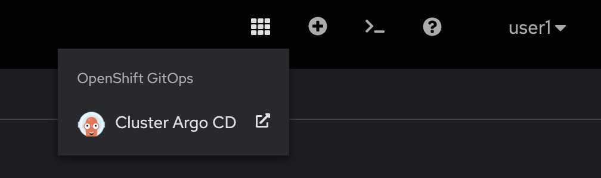
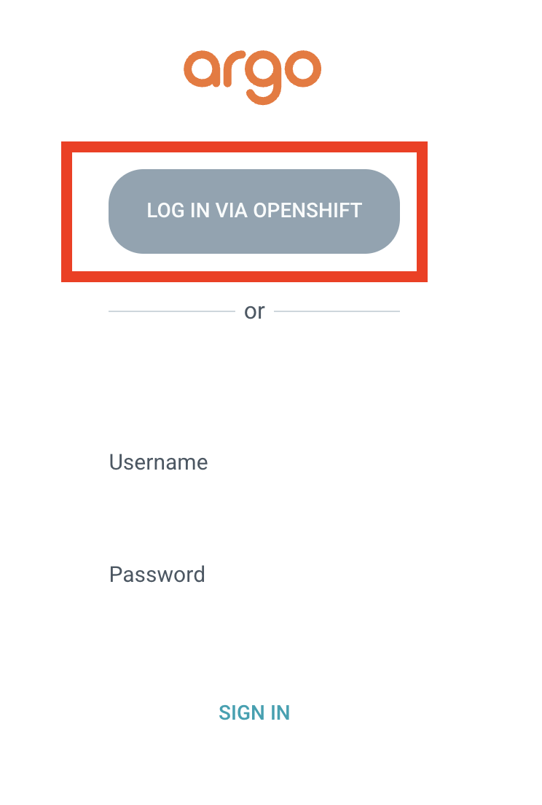
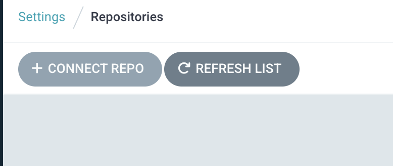
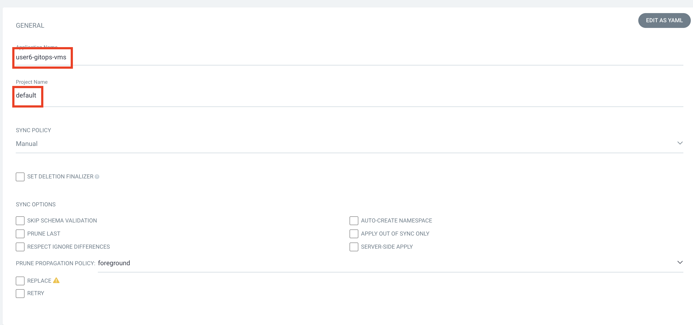
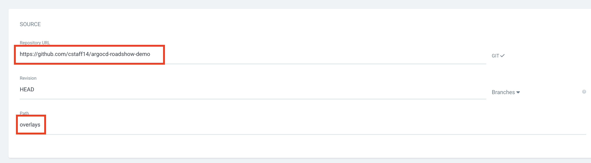
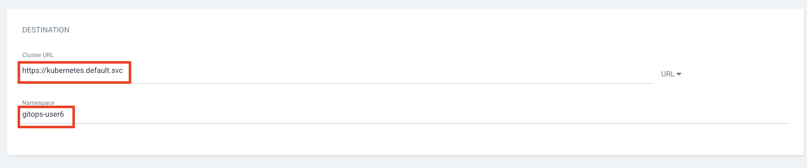
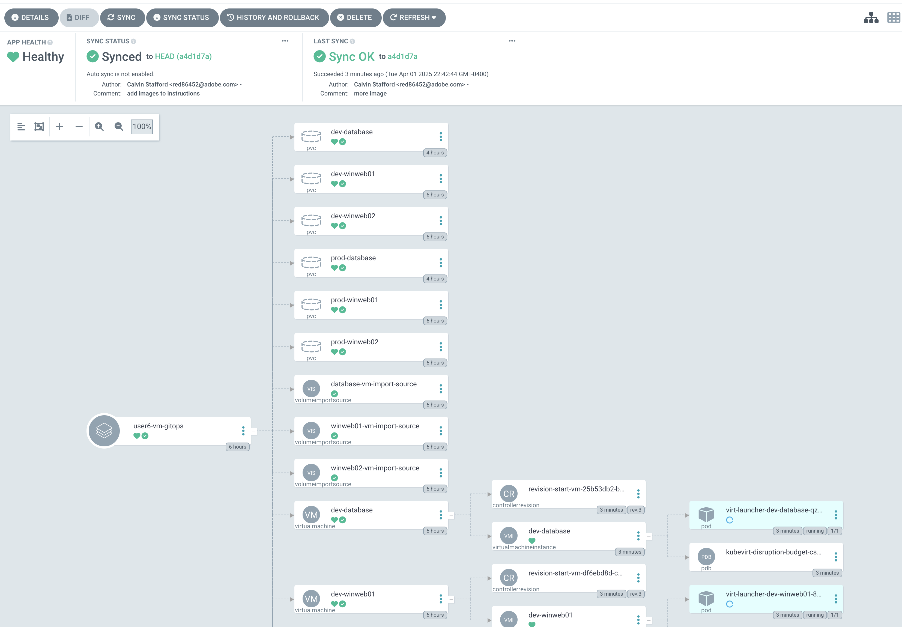

# Using OpenShift GitOps to Deploy VMs in OpenShift Virtualization
This lab is based off a [Developer hub lab](https://developers.redhat.com/learning/learn:manage-openshift-virtual-machines-gitops/resource/resources:connect-and-configure-external-repository-argo-cd-virtual-machines)

## Prereqs
- Complete the **Migrating Existing Virtual Machines** section of the [Red Hat OpenShift Virtualization Roadshow](https://rhpds.github.io/openshift-virt-roadshow-cnv-multi-user/modules/module-02-mtv.html)
- You must ave a GitHub account you can create public repositories from

## Lab Instructions
1. Make a fork of this repo and make sure your fork is **public**
2. In `overlays/kustomization.yaml` change the `namespace` value to `gitops-{your user}`
```
apiVersion: kustomize.config.k8s.io/v1beta1
kind: Kustomization
namespace: gitops-user6
...
```
<!-- TODO: resize the images -->
3. Log into the OpenShift web console, go to **Virtualization > Virtual Machines** from the left hand menu and select the `gitops-{your user}` project at the top of the screen
  

4. Open The AroCD Console and log in
- Click the grid in the top right menu bar and select Cluster ArgoCD

  
- Select login via OpenShift and enter your OpenShift username and password

  
- Enter your OpenShift username and password
  
On the next screen you will see all of the GitOps applications on the cluster. Feel free to explore but don't change any of the other applications

5. Add your GitHub Respository as a repository
- Go to Settings > Repositories

  
- Press Connect Repo

  
- Select VIA HTTPS
- Enter the **URL of the repository you created in step 1** under Repository URL
- Click Connect

  

6. Return to the Applications pane and create a New App With the following info:

  
- Application Name: **{your user}-gitops-vms**
- Project Name: **default**
  
- Repository URL: *Select the repository you added in the previous step*
- Path: *Select **overlays***
  
- Cluster URL: *Select **https://kubernetes.default.svc***
- Namespace: **gitops-user6**
  

7. Click synchronize at the top of the screen and wait for resources to get provisioned and the application to be in a Synced state (this will take some time)
  You will see a synced state in the Application pane:
  

  And running VMs in provisioned PVCs back in the OpenShift web console
  
  

8. Explore these VMs, PVCs, the Argo console or complete the challenges. When you are done **Please shut down your VMs to conserve resources on the cluster**

## Challenge
Complete the services and route definitions in the base directory as well as the dev and prod configs to expose the web application
Hint: complete the [Working with Virtual Machines and Applications](https://rhpds.github.io/openshift-virt-roadshow-cnv-multi-user/modules/module-08-workingvms.html) in the OCPV Roadshow to see how we would do this without GitOps. This will also generate Kubernetes manifests that can help you create the base manifests for these objects.

<!-- TODO: describe and show what the finished product -->