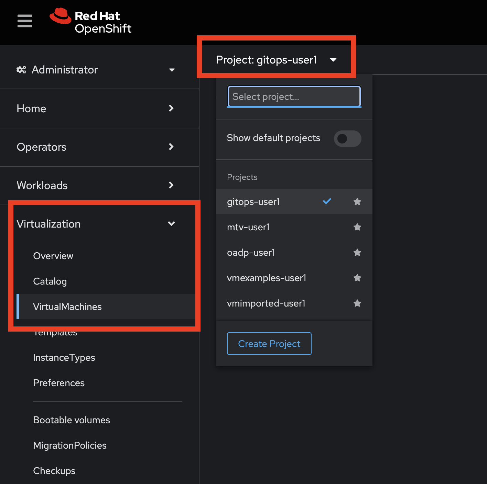
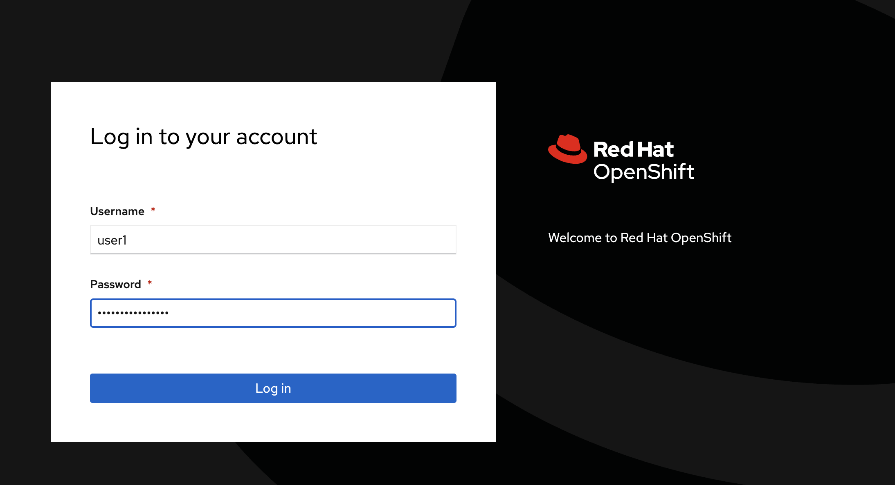
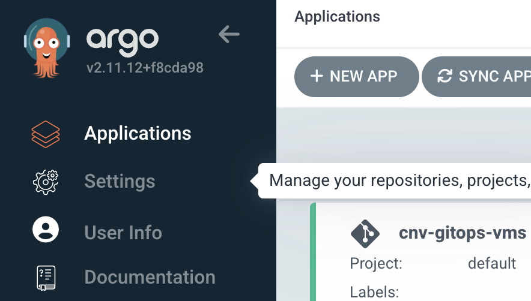
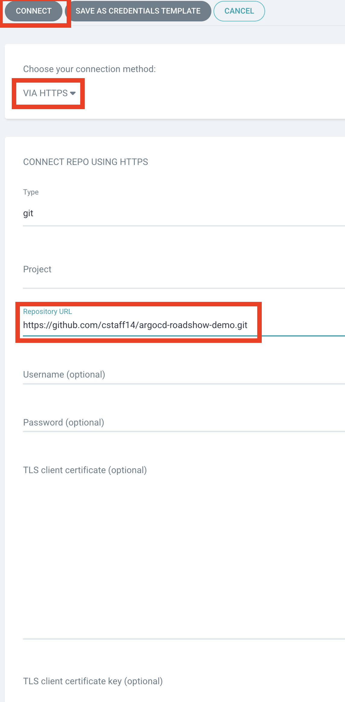
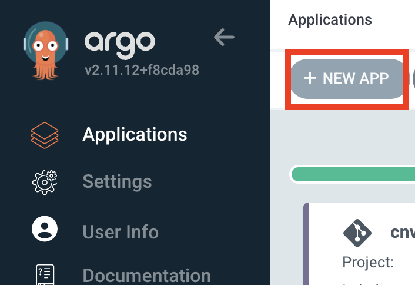

# Using OpenShift GitOps to Deploy VMs in OpenShift Virtualization
This lab is based off a [Developer hub lab](https://developers.redhat.com/learning/learn:manage-openshift-virtual-machines-gitops/resource/resources:connect-and-configure-external-repository-argo-cd-virtual-machines)
## Lab Instructions
1. Make a fork of this repo and make sure your fork is **public**
2. In `overlays/kustomization.yaml` change the `namespace` value to `gitops-{your user}`
```
apiVersion: kustomize.config.k8s.io/v1beta1
kind: Kustomization
namespace: gitops-user6
...
```
3. Log into the OpenShift web console, go to **Virtualization > Virtual Machines** from the left hand menu and select the `gitops-{your user}` project at the top of the screen
  

4. Open The AroCD Console and log in
- Click the grid in the top right menu bar and select Cluster ArgoCD
  
- Select login via OpenShift and enter your OpenShift username and password

  
- Enter your OpenShift username and password
  
On the next screen you will see all of the GitOps applications on the cluster. Feel free to explore but don't change any of the other applications

5. Add your GitHub Respository as a repository
- Go to Settings > Repositories

  
- Press Connect Repo

  
- Select VIA HTTPS
- Enter your repos URL under Repository URL
- Click Connect

  

6. Return to the Applications pane and create a New App With the following info:

  
- Application Name: **{your user}-gitops-vms**
- Project Name: **default**
  
- Repository URL: *Select the repository you added in the previous step*
- Path: *Select **overlays***
  
- Cluster URL: *Select **https://kubernetes.default.svc***
- Namespace: **gitops-user6**
  

7. Wait for resources to get provisioned and the application to be in a Synced state (this will take some time)

## Challenges
### Expose the application via services